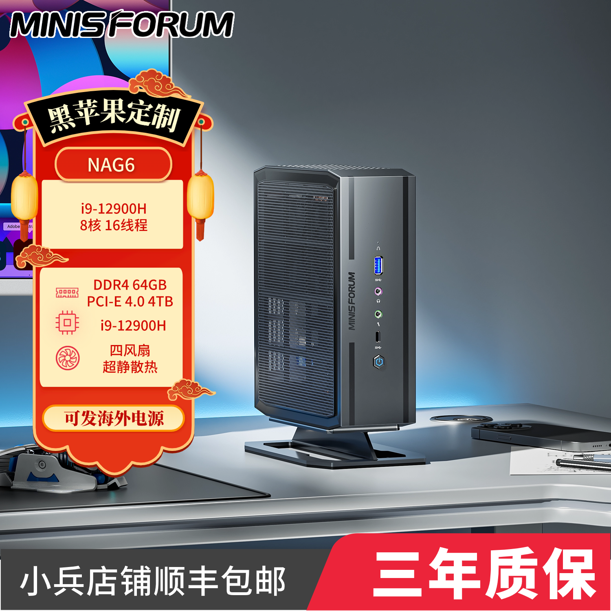
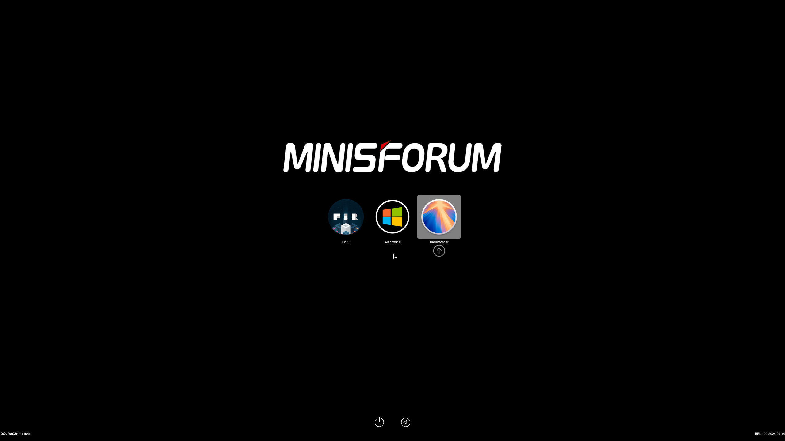
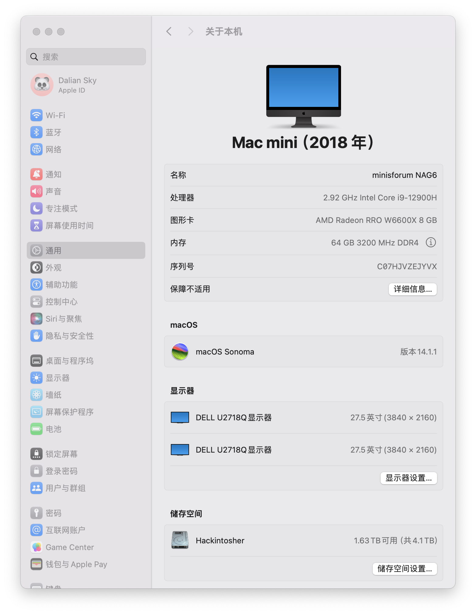
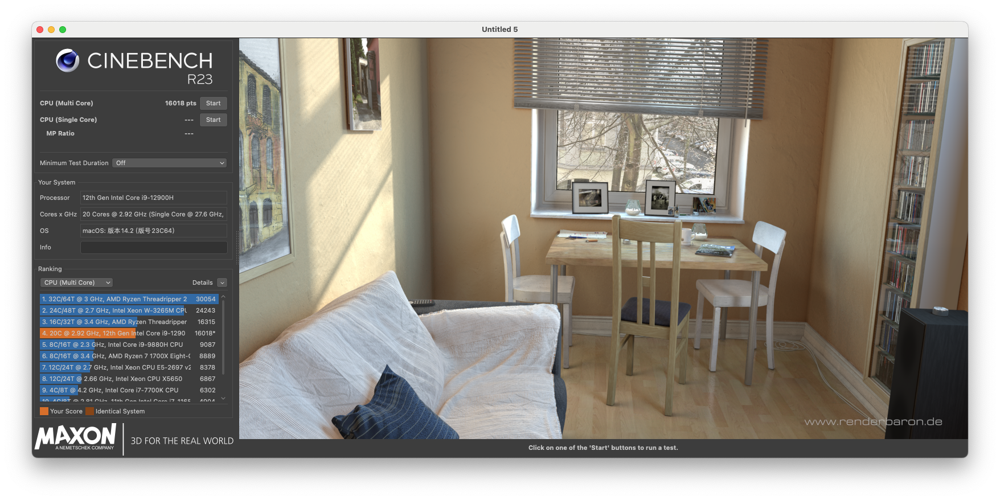
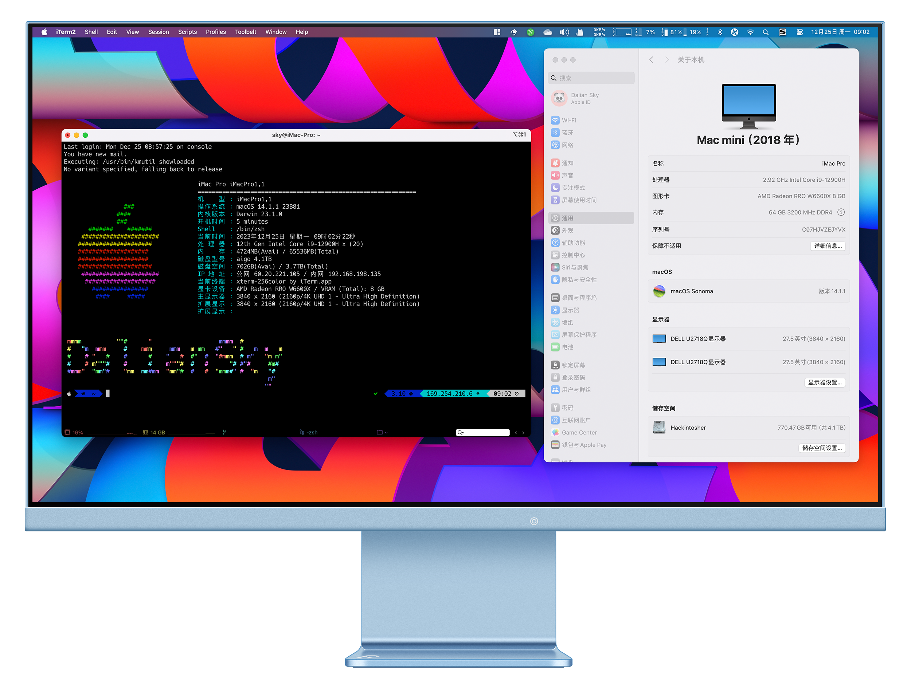

# minisforum-NAG6-Hackintosh

## 配置清单

| 部件             | 型号                              | 是否支持                  |
| :--------------- | :-------------------------------- | :------------------------ |
| CPU              | INTEL i9-12900H                   | 支持                      |
| 内存             | 三星DDR4 3200MHz                  | 支持                      |
| 核显             | Intel® Iris® Xe Graphics eligible | macOS不支持               |
| 独立显卡         | AMD Radeon™ RX 6600M              | 支持，`HDMI`x2 `4K@144Hz` |
| 网卡             | BCM94360NG/Z3/Z4/INTEL AX210      | 支持，原装MTK7921不支持   |
| 蓝牙             | BCM94360NG/Z3/Z4/INTEL AX210      | 支持，原装MTK7921不支持   |
| 硬盘1            | aigo NVMe SSD P7000Z 4TB          | 支持                      |
| 硬盘2/3          | SATA 2.5寸 7mm                    | 支持                      |
| USB              | 10Gbps /                          | 支持                      |
| 音频/3.5耳机接口 | ALC269 id:`111`                   | 支持                      |
| 音频/HDMI输出    |                                   | 支持                      |
| 隔空             |                                   | 支持                      |
| 接力             |                                   | 支持                      |
| 随航             |                                   | 不支持                    |
| 通用控制         |                                   | 支持                      |

## INTEL 十二代 i9-12900H

- 拥有 `12核`  / `20线程`

- 最高频率：`5GHz`

- TDP:

- - 基本功率：`45W`
  - 最高功率：`115W`
  - 最低保证功率：`35W`

## AMD Radeon™ RX 6600M

- 显卡

- - 计算单元：`28`
  - GPU时钟：`2177MHz`
  - 峰值纹理填充率：`272.2GT/s`
  - 流处理器：`1792`
  - 显卡功率：`100W`

- 显存

- - 显存：`GDDR6` 
  - 显存容量：`8GB`

- 支持的渲染格式

- - HDMI™ 4K Support：`Yes`
  - 4K H264 解码: `Yes`
  - 4K H264 编码: `Yes`
  - H265/HEVC 解码: `Yes`
  - H265/HEVC 编码: `Yes`
  - AV1 解码: `Yes`

## 更新日志

- 9-29-2024

  - 更新 `OpenCore` `v1.0.2` 开发版
  - 更新 `IOSkywalkFamily.kext` 到 `v1.2.0`
  - 支持 `Sequoia` (博通无线网卡)
  - `Sequoia` 如果想更新到 `15.0` 请务必先更新 `EFI` ，然后再安装 [OCLP](https://pan.daliansky.net/APPS/OCLP/OCLP.md)，重启后，再升级到 `15.0` 否则会出现 `WIFI` 无法启用的问题

- 3-11-2024

  - 更新`OpenCore Mod` 到 `v0.9.9`
  - 更新 `IOSkywalkFamily.kext` 到 `v1.1.0`
  - `Sonoma` 如果想更新到 `14.4` 请务必先更新 `EFI` ，然后再安装 [OCLP](https://pan.daliansky.net/APPS/OCLP/OCLP.md)，重启后，再升级到 `14.4` 否则会出现 `WIFI` 无法启用的问题

- 1-8-2024

  - 更新`OpenCore Mod` 到 `v0.9.8`
  - 修复超线程
  - 修复cpu型号显示异常

  

## 截图

